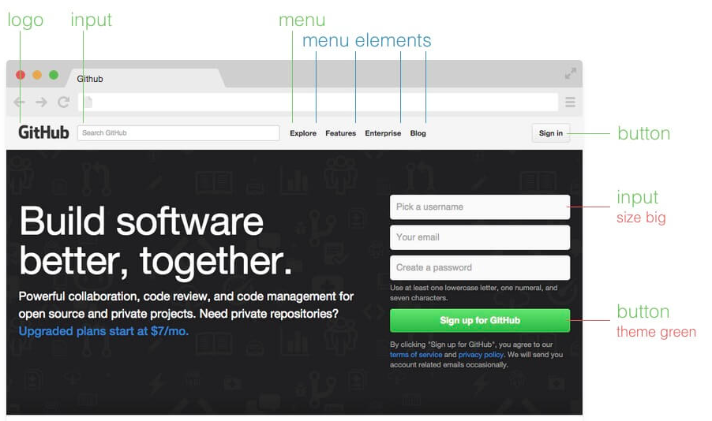

**Block Element Modifier** is a methodology that helps you to create reusable components and code sharing in front-end development.



## Blocks, Elements and Modifiers

You will not be surprised to hear that BEM is an abbreviation of the key elements of the methodology — Block, Element and Modifier.

### Block

Standalone entity that is meaningful on its own.
Examples: `header`, `container`, `menu`, `checkbox`, `input`

### Element

A part of a block that has no standalone meaning and is semantically tied to its block.

Examples: `menu item`, `list item`, `checkbox caption`, `header title`

### Modifier

A flag on a block or element. Use them to change appearance or behavior.

Examples: `disabled`, `highlighted`, `checked`, `fixed`, `size big`, `color yellow`

## Example

HTML

```html
<form class="form form--theme-xmas form--simple">
  <input class="form__input" type="text" />
  <input class="form__submit form__submit--disabled" type="submit" />
</form>
```

CSS

<!-- prettier-ignore -->
```css
.form { }
.form--theme-xmas { }
.form--simple { }
.form__input { }
.form__submit { }
.form__submit--disabled { }
```

## Resources

http://getbem.com/introduction/

http://getbem.com/naming/
