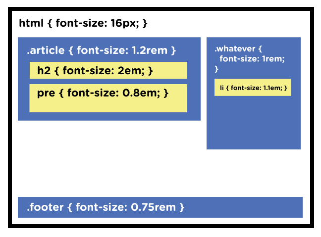

## Concepts

- **EM** is relative to the parent element’s font size, so if you wish to scale the element’s size based on its parent’s size, use EM.

- **REM** is relative to the root (HTML) font size, so if you wish to scale the element’s size based on the root size, no matter what the parent size is, use REM. If you’ve used EM and are finding sizing issues due to lots of nested elements, REM will probably be the better choice.

- **VW** is useful for creating full width elements (100%) that fill up the entire viewport’s width. Of course, you can use any percentage of the viewport’s width to achieve other goals, such as 50% for half the width, etc.

- **VH** is useful for creating full height elements (100%) that fill up the entire viewport’s height. Of course, you can use any percentage of the viewport’s height to achieve other goals, such as 50% for half the height, etc.

- **%** is similar to VW and VH but it is not a length that is relative to viewport’s width or height. Instead, it is a percentage of the parent element’s width or height. Percentage units are often useful to set the width of margins, as an example.

## When Should You Use One Unit Over Another?

We should use both em and rem units depending on the relationship it might have with other elements on the page.

> You still keep `px` size adjustments at the document level so you can make easy/efficient sweeping size changes. But then each module on the page has a font-size set in `rem`. Actual text elements _(h1, h2, p, li, whatever)_, if you size them at all, are sized in `em`, and thus become relative to the module.

This way you can adjust font-size at a module level, which is pretty easy. The chances the type within a single module have good proportions and can scale together nicely is high



```css
/* Document level adjustments */

html {
  font-size: 16px;
}

/* Modules will scale with document */
.header {
  font-size: 1.5rem;
}
.footer {
  font-size: 0.75rem;
}
.sidebar {
  font-size: 0.85rem;
}

/* Type will scale with modules */
h1 {
  font-size: 3em;
}
h2 {
  font-size: 2.5em;
}
h3 {
  font-size: 2em;
}
```

## Resources

https://medium.com/code-better/css-units-for-font-size-px-em-rem-79f7e592bb97

https://elementor.com/help/whats-the-difference-between-px-em-rem-vw-and-vh/
