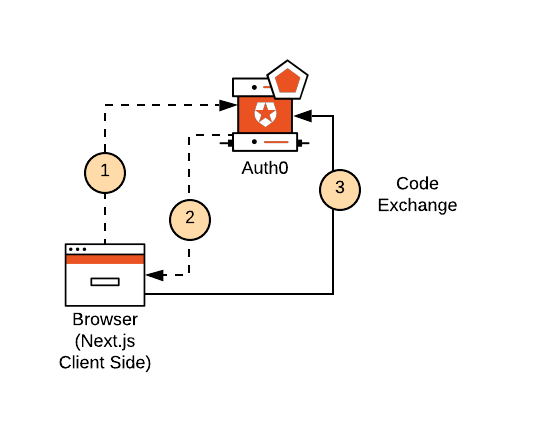
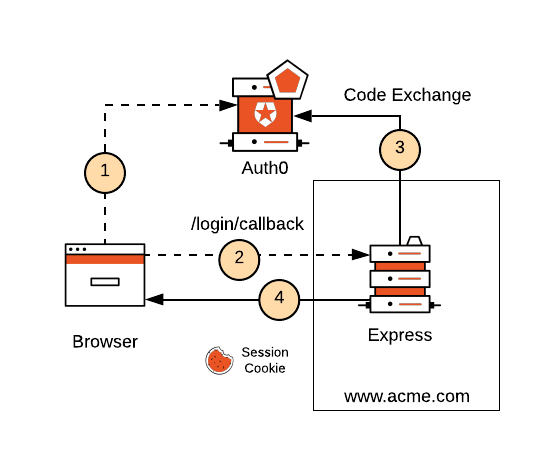
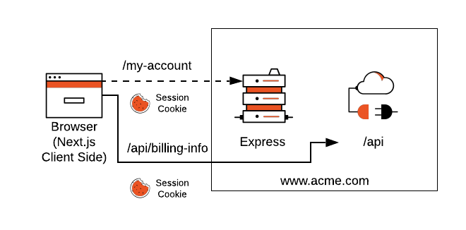

Let's explore the authentication strategies you can implement for different deployment models.

## Static site approach

1. Your static site redirects your users to log in.
2. When your users successfully log in, Auth provider redirects them to your static site.
3. Your static site performs a code exchange with Auth Provider to retrieve the user's `id_token` and `access_token`, which it stores in memory.

If your use case requires dynamic content or user-specific content, you will also need to deploy something else, like an API. This API won't run as part of your static hosting site. You'll use a platform like AWS Lambda, Heroku, or Now, to deploy it. Your static site (the client-side) will use the `access_token` to make secure calls to that API directly, fetch the dynamic content, and enrich the static page served by the hosting platform.

## Authenticating in a custom server model

Middlewares provide building blocks to your application like:

- Authentication
- Sessions
- Enforcing authentication and authorization
- Rate limiting

All the building blocks and tools that you can use today with Express.js are available to you in this custom server model. Here's the most basic example of how you would host your application with Express.js:

When it comes to authenticating users in the custom server model, you can use Passport.js. When the user logs in, Passport.js creates a session using express-session and persists it in the browser using an `HttpOnly cookie`.

Once the user has a session, they can access pages or call API endpoints that require authentication using traditional Express endpoints. The client application sends the session cookie along with each request, which makes the user information available on the server-side automatically.

## Resources

[NextJs Auth0](https://auth0.com/blog/ultimate-guide-nextjs-authentication-auth0)
