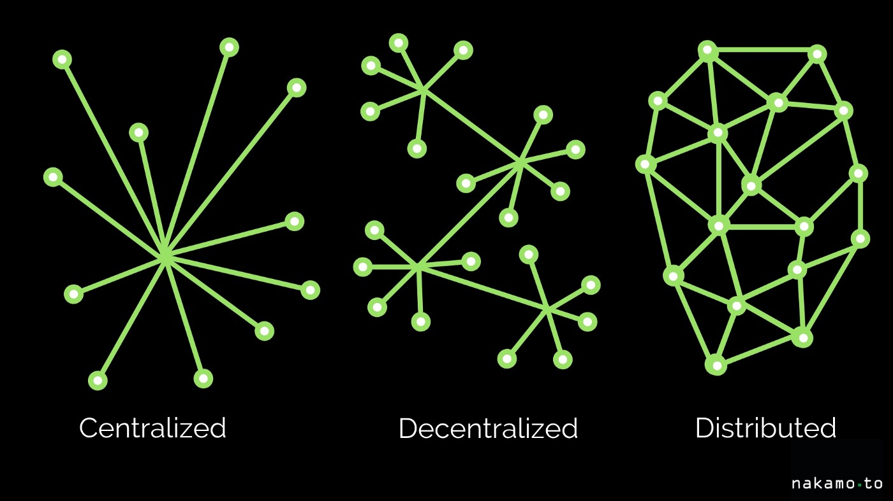
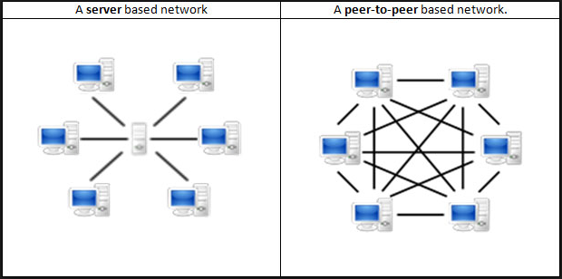
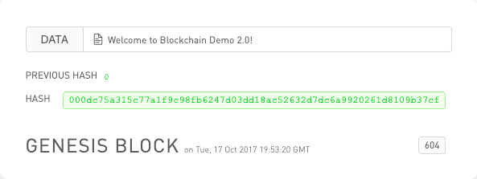
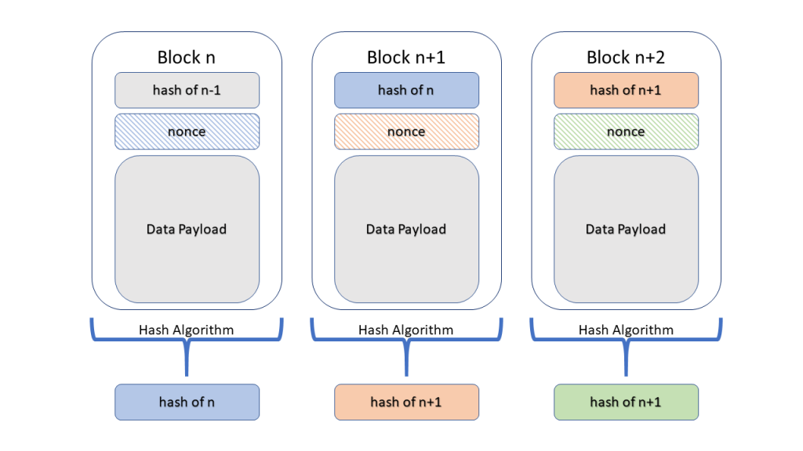

A blockchain is a distributed database of a list of validated blocks. Each block contains data in the form of transactions and each block is cryptographically tied to its predecessor, producing a "chain".



Blockchains are not just decentralized but also distributed databases. Those little circles are meant to be "nodes".

A blockchain has nodes scattered all over the world all acting together in real-time. There is no central administrator, say a "supernode", responsible for verifying any changes to the state of data, all nodes are equal members of the network.

This means that the network will perform the same, no matter what node you interact with to update data. In other words, blockchains are peer-to-peer networks.



In the image above, the server-based network contains one central server solely responsible for keeping the state of data. In the peer-to-peer network, there is not even a central server - everyone maintains a copy of the state of data.

## Blockchain Demo

**A blockchain has a list of blocks. It starts with a single block, called the genesis block.**



### How is the block hash calculated?

```js
hash = f ( index + previous hash + timestamp + data + nonce );
```

### Adding a New Block

The demo continues with a brief explanation of what it takes to add new blocks to the blockchain.

When adding a new block to the blockchain, the new block needs to meet these requirements:

- Block index is one greater than latest block index.
- Block previous hash equal to latest block hash.
- Block hash meets difficulty requirement.
- Block hash is correctly calculated.

### Who performs validation of new blocks?

If our blockchain consists of 10 nodes, then we have a peer-to-peer network consisting of 10 nodes all interconnected to each other. When one node, or peer, proposes a new block, every other peer will verify it to make sure it meets the consensus requirements. If it does, the peer adds the block to their own ledger and will see that version as the one "true" chain. So will any other peers rigged up to the same consensus rules.

## Build a Blockchain



Blockchains are run by a network of computers. When a computer finds a new block, it broadcasts its new version of the blockchain to all of its peers. There may be multiple versions of the blockchain at any given time. However, the longest valid blockchain is the accepted one.

```js
const Block = require("./Block");

class Blockchain {
  constructor() {
    this.chain = [new Block()];
  }

  addBlock(block) {
    block.previousHash = this.chain[this.chain.length - 1].toHash();
    this.chain.push(block);
  }

  isValid() {
    let isValid = true;
    for (let i = 1; i < this.chain.length; i++) {
      const prevHash = this.chain[i - 1].toHash();
      const blockHash = this.chain[i].previousHash;
      if (prevHash.toString() !== blockHash.toString()) {
        isValid = false;
        break;
      }
    }
    return isValid;
  }
}

module.exports = Blockchain;
```

## 51% Attack

A 51% attack refers to a point in time where a group of miners have control of more than 50% of the network and wish to act maliciously. How much damage can actually be done during this time?

To change a block that has been confirmed many times, let's say the block has been confirmed 6 times for example, the attacking blockchain would need to mine 8 new blocks before the existing blockchain mines 1 to be accepted as the Main Chain.

`This would require more than just 51% of the resources!`

:::info
The attacking blockchain could also just stubbornly stick to its chain for a longer period of time. The more time they do this, the more expensive the attack becomes.
:::
