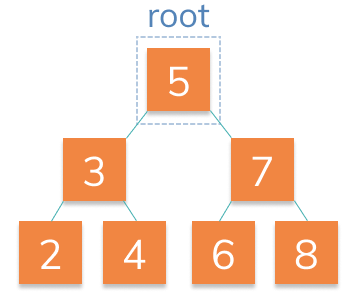

### Binary Search Tree

The word binary indicates that each nodes has at most 2 children. It's called a search tree because the order of the nodes is sorted by the value of the data. Let's take a look at an example:



Any child that is to the left of it's parent is smaller. Any child that is to the right of it's parent is greater. For example, the root `5` has two children `3` and `7`. Since `3` is less than `5`, it is to the left of `5`.

Knowing that the data is in this order, it will take us less time to find a particular node. **We can look for 4**. Starting at the root, we know it's less than `5` so we go left. We encounter `3` next and know that `4` is greater than `3`, so we go right. There, we find `4`. On average this will be faster than searching randomly. The time savings become greater the bigger the tree is.

### Merkle Trees

Quite simply, a Merkle Tree is a data structure that allows us to make efficient verifications that data belongs in a larger set of data.

They are commonly used in Peer to Peer networks where efficient proofs of this nature will help increase the scalability of the network.

```
      ABCDEFGH <-- Merkle Root
       /    \
    ABCD     EFGH
    / \      / \
   AB  CD   EF  GH
  / \  / \  / \ / \
  A B  C D  E F G H
```

Each single letter represents a hash. The combined letters represent concatenated hashes that have been combined and hashed to form a new hash.

As peers in a system, I can simply ask if your root matches mine. If so, we agree. This is a nice optimization for distributed systems of any kind!

This binary tree structure affords us one further optimization: it allows us to verify a single piece of data belongs in the tree **without having all of the data**.

```
      ABCDEFGH
       /    \
    ABCD     EFGH
    / \      / \
   -  -     EF  GH
  / \  / \  / \ / \
  - -  - -  E F -  -
```

#### What do we need in order to prove that `E` belongs in this tree?

Just `F`, `GH`, `ABCD`. We use these to calculate `EF`, `EFGH`, and `ABCDEFGH`. Then we can compare the result to our expected root `ABCDEFGH`.

If something went wrong along the way, we would notice it at the root. For example if we replaced `E` with `M`:

```
      ABCDMFGH
       /    \
    ABCD     MFGH
    / \      / \
   -  -     MF  GH
  / \  / \  / \ / \
  - -  - -  M F -  -
```

We can quickly check `ABCDMFGH` against the our expected root `ABCDEFGH` and see we did not get our expected hash. Something's wrong.

The savings become important with larger trees where the average case for verification of tree is `log2(n)` where `n` is the number of nodes in the tree. So for a tree of size 128, it would take only 7 hashes to determine the root.
