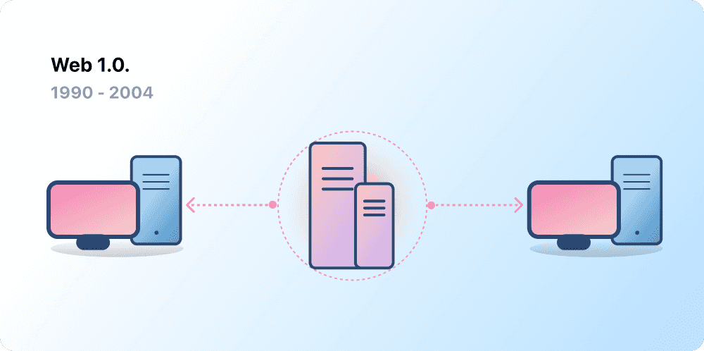
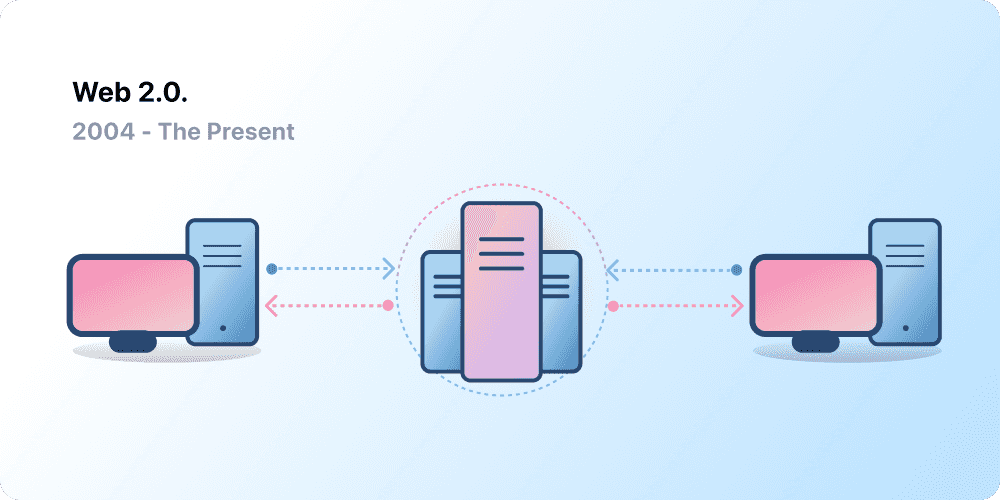

## Introduction to Web3

Centralization has helped onboard billions of people to the internet and created the stable, robust infrastructure on which it lives. At the same time, a handful of centralized entities have a stronghold on large swathes of the internet, unilaterally deciding what should and should not be allowed.

Web3 is the answer to this dilemma. Instead of an internet monopolized by large technology companies, Web3 embraces decentralization and is being built, operated, and owned by its users. Web3 puts power in the hands of individuals rather than corporations.

## The early internet

### Web 1.0: Read-Only (1990-2004)

The first inception of the internet, now known as 'Web 1.0', occurred roughly between 1990 to 2004. The internet on Web 1.0 mainly was static websites owned by companies, and there was close to zero interaction between users - individuals seldom produced content - leading to it being known as the read-only web.

### Web 2.0: Read-Write (2004-now)

The Web 2.0 period began in 2004 with the emergence of social media platforms. Instead of a read-only, the web evolved to be read-write. Instead of companies providing content to users, they also began to provide platforms to share user-generated content and engage in user-to-user interactions. As more people came online, a handful of top companies began to control a disproportionate amount of the traffic and value generated on the web. Web 2.0 also birthed the advertising-driven revenue model. While users could create content, they didn't own it or benefit from its monetization.

### Web 3.0: Read-Write-Own

Web3 has become a catch-all term for the vision of a new, better internet. At its core, Web3 uses blockchains, cryptocurrencies, and NFTs to give power back to the users in the form of ownership.

#### Core ideas of Web3

Although it's challenging to provide a rigid definition of what Web3 is, a few core principles guide its creation.

- **Web3 is decentralized:** instead of large swathes of the internet controlled and owned by centralized entities, ownership gets distributed amongst its builders and users.
- **Web3 is permissionless:** everyone has equal access to participate in Web3, and no one gets excluded.
- **Web3 has native payments:** it uses cryptocurrency for spending and sending money online instead of relying on the outdated infrastructure of banks and payment processors.
- **Web3 is trustless:** it operates using incentives and economic mechanisms instead of relying on trusted third-parties.

## Why is Web3 important?

### Ownership

Web3 allows for direct ownership through **non-fungible tokens (NFTs)**. NFTs are tokens that we can use to represent ownership of unique items. They let us tokenise things like art, collectibles, even real estate. They can only have one official owner at a time and they're secured by the Ethereum blockchain – no one can modify the record of ownership or copy/paste a new NFT into existence.

### Censorship resistance

The power dynamic between platforms and content creators is massively imbalanced. On Web3, your data lives on the blockchain. When you decide to leave a platform, you can take your reputation with you, plugging it into another interface that more clearly aligns with your values.

Web 2.0 requires content creators to trust platforms not to change the rules, but censorship resistance is a native feature of a Web3 platform.

### Identity

Traditionally, you would create an account for every platform you use. For example, you might have a Twitter account, a YouTube account, and a Reddit account. Want to change your display name or profile picture? You have to do it across every account. You can use social sign-ins in some cases, but this presents a familiar problem—censorship.

In a single click, these platforms can lock you out of your entire online life. Even worse, many platforms require you to trust them with personally identifiable information to create an account.

Web3 solves these problems by allowing you to control your digital identity with an address and ENS profile. Using an address provides a single login across platforms that is secure, censorship-resistant, and anonymous.

### Native payments

Web2's payment infrastructure relies on banks and payment processors, excluding people without bank accounts or those who happen to live within the borders of the wrong country. Web3 uses tokens like ETH to send money directly in the browser and requires no trusted third party.
